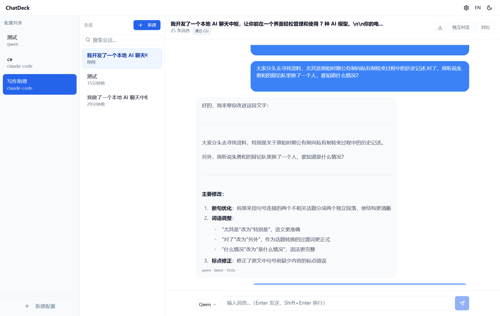
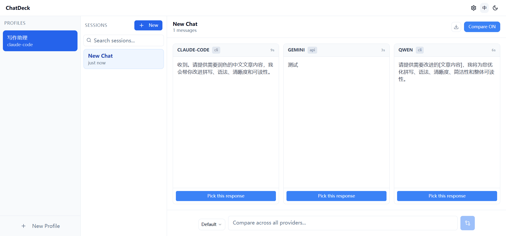

# ChatDeck

> 365 开源计划 #006 · 本地 AI 聊天中心，一个界面管理所有 AI 服务

[English](README.md)

本地 AI 对话中心，也是你的 AI 工具箱。一个界面统一调用所有 AI，一键开聊。



## 为什么选 ChatDeck

**把 AI 当工具用，而不只是聊天。** 大多数 AI 界面都是为多轮对话设计的。但很多任务根本不需要上下文 — 你只想把文本丢给 AI，拿到结果就走。文本润色、翻译、摘要、代码审查……这些事你每天要做几十次，之前的对话记录只会干扰结果。

ChatDeck 的**独立对话模式**会在每次请求时清除所有历史。每条消息都只带系统提示词从零开始处理 — 没有上下文泄漏，没有前序对话的污染。创建一个「文本润色」配置，它就变成一个专用的润色工具：输入文本，输出结果，每次都干干净净。

再加上**配置预设**（服务商 + 系统提示词，一次配好反复用）和**对比模式**（同一输入发给多个服务商并排对比），ChatDeck 把你本地的 AI 工具变成一个快速、有序的工作流。

### 核心亮点

- **独立对话模式** - 每条消息零上下文，只有系统提示词 + 当前输入。文本润色、翻译等高频单次任务的最佳选择
- **配置预设** - 预先设好服务商 + 系统提示词，点击即用，不用每次重新配置
- **对比模式** - 同一提示词发给多个服务商，选最好的结果
- **免费使用** - 直接调用本机 CLI 工具（`claude`、`qwen`、`ollama`），用你现有的订阅，API 密钥可选
- **7 个服务商** - Claude、OpenAI、Gemini、Qwen、DeepSeek、Groq、Ollama



## 快速开始

**环境要求：** Node.js >= 18

```bash
npm install
npm run dev
```

打开 http://localhost:3456

也可以直接用启动脚本：`start.bat`（Windows）/ `bash start.sh`（macOS/Linux）。

## 使用流程

1. **创建配置** - 选择服务商，设置系统提示词，取个名字。独立对话模式默认开启
2. **点击即用** - 在侧边栏选择配置，直接输入消息
3. **随时回看** - 所有会话按配置自动保存，方便查找和继续

## 全部功能

- **一键开聊** - 选个配置就能用，不用敲命令、不用配参数
- **独立对话模式** - 可在配置中默认开启，也可在对话中随时切换。高频文本任务的利器
- **对比模式** - 多服务商并排对比
- **7 个服务商** - Claude、OpenAI、Gemini、Qwen、DeepSeek、Groq、Ollama
- **CLI 免费用** - 调用本机已安装的工具，零 API 费用
- **会话分叉** - 编辑任意消息，分支出新对话
- **导出** - 将对话下载为 Markdown 文件
- **深色模式**和**中英双语**界面

## 服务商配置

每个服务商支持两种调用方式：

| 方式 | 说明 | 费用 |
|------|------|------|
| **CLI**（推荐） | 调用本机已安装的工具，如 `claude`、`ollama`、`qwen` | 免费（使用你的订阅套餐） |
| **API** | 直接调用 API，需填写密钥 | 按量付费 |

CLI 工具会自动检测。如需配置 API 密钥，点击右上角齿轮图标进入设置。

### API 密钥获取

| 服务商 | 获取地址 |
|--------|---------|
| Claude | [console.anthropic.com](https://console.anthropic.com/)（可选，通过 `claude` CLI 免费使用） |
| Gemini | [aistudio.google.com/apikey](https://aistudio.google.com/apikey) |
| Qwen | [bailian.console.aliyun.com](https://bailian.console.aliyun.com/)（DashScope API） |
| DeepSeek | [platform.deepseek.com](https://platform.deepseek.com/) |
| Groq | [console.groq.com](https://console.groq.com/) |
| Ollama | 无需密钥（本地运行） |

## 快捷键

| 快捷键 | 功能 |
|--------|------|
| `Ctrl+N` | 新建会话 |
| `Ctrl+/` | 切换对比模式 |
| `Ctrl+E` | 导出为 Markdown |
| `Ctrl+1~4` | 切换服务商 |

## 生产部署

```bash
npm run build
npm start
```

或通过 CLI：

```bash
npx chat-deck              # 默认端口 3456
npx chat-deck -p 8080      # 自定义端口
```

## 项目结构

```
packages/
  client/    React + Vite 前端
  server/    Express + WebSocket 后端
  shared/    共享 TypeScript 类型定义
```

## 关于 365 开源计划

本项目是 [365 开源计划](https://github.com/rockbenben/365opensource) 的第 006 个项目。

一个人 + AI，一年 300+ 个开源项目。[提交你的需求 →](https://my.feishu.cn/share/base/form/shrcnI6y7rrmlSjbzkYXh6sjmzb)

## 许可证

MIT
